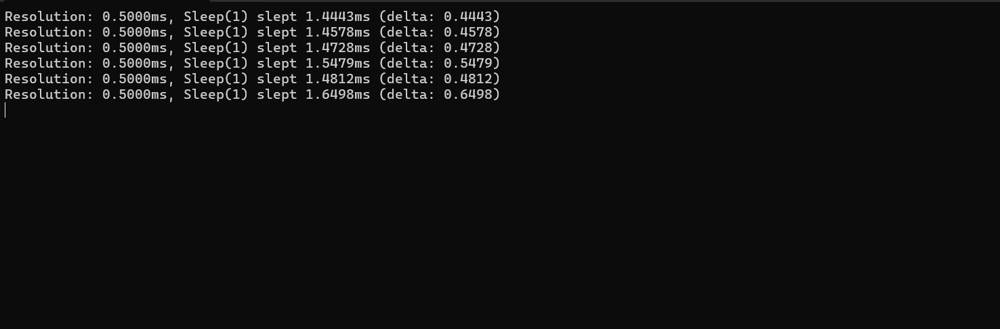
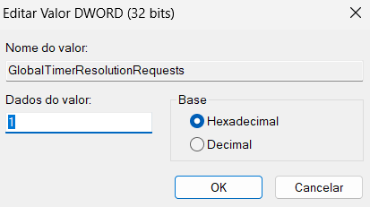
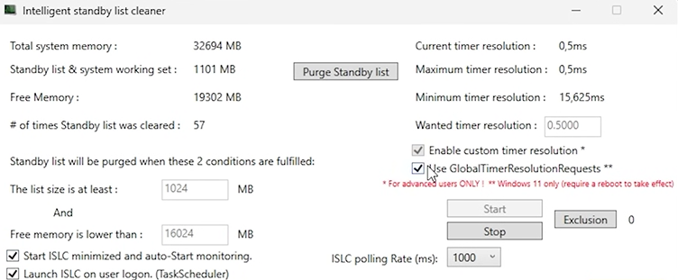
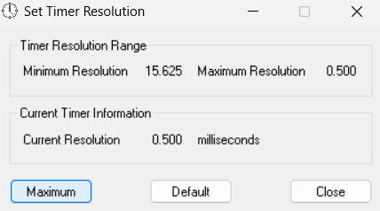

# 💻 how to reduce input lag
_is a solution designed to reduce input lag on Windows systems, enhancing system responsiveness and improving the experience in gaming or critical applications. The project combines essential tools to fine-tune system settings and optimize performance_

### Features
_This project utilizes carefully selected and configured tools to eliminate delays caused by memory overload and inaccuracies in system resolution. Below are the tools integrated into InputOptimizer:_


## **1. Measure Sleep**
MeasureSleep is a precision tool designed to measure execution times or delays between commands in computational systems. It is widely used in scenarios that demand high temporal sensitivity, such as operating system performance testing, real-time applications, and development environments.

**Key Components**

**Sleep Function:**
The Sleep function is a command used to pause the system for a specified period (in this case, 1 millisecond). However, the actual time the system "sleeps" can vary due to hardware, software, and OS-level timing limitations.

- For example, in the screenshot, the requested sleep is `1ms`, but the actual sleep time consistently exceeds this value `(e.g., 1.4443ms, 1.4578ms)`.
<br>



<br>


**Delta:** The delta represents the difference between the requested sleep time `(1ms)` and the actual sleep time measured. This value highlights the latency or inaccuracy in the system's timer resolution.

- For instance, deltas like `0.4443ms` or `0.4578ms` show that the system took almost half a millisecond longer than intended to resume operations.

**Applications**

- Temporal accuracy testing: Evaluates the precision of time-related functions in systems, such as Sleep() or other timers.
- Input lag diagnostics: Detects delays in systems that require quick responses, such as gaming or high-performance hardware.
- Software development: Useful for developers needing to validate or optimize the response time of functions or routines in their applications.

## **2. GlobalTimerResolutionRequests**

### _Step-by-Step Guide_



**Open the Registry Editor:**

- Press Win + R to open the Run dialog box.
- Type regedit and press Enter.
- If prompted by User Account Control (UAC), click Yes to proceed.

**Navigate to the Target Path:**
- In the Registry Editor, locate the following key:

`HKEY_LOCAL_MACHINE\SYSTEM\CurrentControlSet\Control\Session Manager\kernel`

**Create a New Key:**

- Right-click on the right panel of the kernel folder.
- Select New > DWORD (32-bit) Value.

**Name the New Key:**

- Rename the newly created key to:
`GlobalTimerResolutionRequests`

**Edit the Key Value:**

- Double-click the GlobalTimerResolutionRequests key.
- In the Value Data field, enter:
```
1
```
- Ensure the Base is set to Hexadecimal.
- Click OK to save.

**Close the Registry Editor:**
- Close the Registry Editor and restart your computer to apply the changes.

## **3. ISCL (Intelligent System Cache Limiter)**
A tool that automatically manages RAM by clearing the system cache before memory usage reaches critical levels.

<br>

It is recommended to set the memory cache cleanup limit to half of the total available RAM:
- 8GB RAM: Configure it to clean when it reaches 4GB.
- 16GB RAM: Configure it to clean when it reaches 8GB.
- 32GB RAM: Configure it to clean when it reaches 16GB.

<br>



<br>

**Technical Benefits:**
- Reduces excessive memory usage that can cause delays.
- Improves fluidity in applications and games, especially on systems with limited memory.

<br>

## **4. TimerResolution**
A simple tool that adjusts the system timer resolution to the minimum supported value, optimizing time interval precision.

**How to Use:**

- Open TimerResolution.
- Click the "Maximum" button.

<br>



<br>

**Technical Benefits:** 
- Enhances the precision of system events.
- Ideal for low-latency environments such as gaming or real-time systems.
### Note:
TimerResolution does not require additional configuration. Simply activate it and let it run in the background.

### Bonus:
input in your CMD

`bcdedit /set useplatformtick yes`

`bcdedit /set disabledynamictick yes`

`bcdedit /deletevalue useplatformclock`
